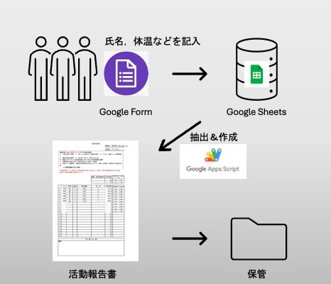

# コロナ禍のためのサークル活動報告書自動生成コード
 
 コロナ禍にサークル活動をするうえで義務付けられていた，活動報告書の作成を自動化するコードである．

## 作成の経緯と目的

 私の所属していた大学では，コロナ禍にサークル活動をするために，活動場所（通称BOX）への入退室時に，その時間，名前，学生番号，当日の体温を活動報告書に記入し，保管しておくことが求められていた．
 これは，部員にコロナ感染者が出たときに，保管しておいた活動報告書から濃厚接触者を特定し，すみやかに自宅待機をさせることができるためである．
 活動報告書の作成は交代制で回していたが，面倒で作成をサボるものや，忘れるものが後を立たなかった．
 そして，コロナ感染者が出てから慌てて過去の記録をさかのぼって活動報告書を作成するということが日常茶飯事であった．
 そのため，私はこの面倒な活動報告書の作成を[Google App Scripts](https://www.google.com/script/start/)(GAS)で自動化することにした．
 以上がこのコードを作成した経緯と目的である．

## 仕組み
 1. 入退室の際に，部員にはGoogle Formに必要な情報を入力してもらう．
 入力内容はスプレッドシートに記録される．
 2. スプレッドシートのタイムスタンプから，その日に入退室した部員を特定する.
 3. 毎日夜の23:59分にスクリプトのトリガーを設定し，その日に入退室した部員の情報を抽出，テンプレートから活動報告書を作成する．
 4. 活動報告書を保管場所のディレクトリに格納

<figure>
  
  

  <figcaption>イメージ図</figcaption>
</figure>

## 使用技術
- Google App Scripts(GAS)
- JaveScript
- Google Spread Sheets
- Google Form

## 実行方法
1. 大学から提供された活動報告書テンプレートをGoogle Drive上に保存し，そのスプレッドシートIDをプログラムに書く．
2. Google Formの回答を保存しているGoogle SheetsのスプレッドシートIDもプログラムに書く．
3. main.gsをGASにコピペし，main.gsのAutomationにトリガーを設定すれば，毎日活動報告書を作成してくれる．

## 連絡先
何かご要件，ご要望があれば以下まで．

junya737[@]gmail.com
